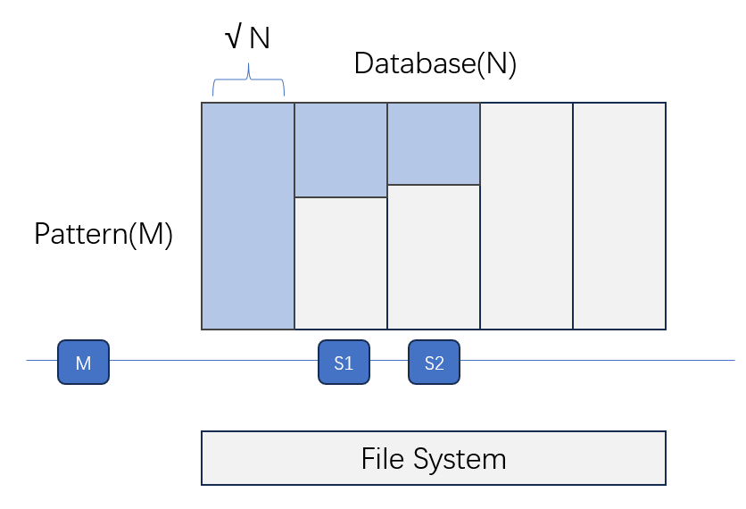

## 算法

### Master

**computing matrix**

一个M用于协调，其他S计算各自要算的任务，S只和M交流

M收到S的topK后，更新全局TopK并备份TopK和该块的右边，选择下一个任务块给S

M收到S算出的部分右边后，存入内存，将其转发给需要的S

M的存储的一个边完整，且该边不是任何任务的左边时，将其从内存中删除

**traceback**

根据全局TopK，分别安排任务给S

所有任务完成后，terminate所有Slave和自己

**crush handling**

master向slave发送心跳包

slave timemout时，master 发送remake信息终止其余所有节点的工作，从磁盘重启并自己作为M

### Slave

**computing matrix**

S收到M的计算任务时，开始等待M的左边发送

S收到M获取部分左边后，计算矩阵，每算完一行向M发送该行的右边

S算完后向M发送topK后闲置

**traceback**

S收到M的traceback任务时，开始独立运算

从存储中读取对应块的左边，重新通过计算复现原矩阵

达到边界时读取下一个对应左边，重复操作

完成后将结果写入磁盘，通知master任务完成

**crush handling**

slave回复master的心跳包

master timeout时，master的rank+1对应的slave发送remake信息终止其余所有节点的工作，从磁盘重启并自己作为M

收到remake时，放弃自身所有工作并等待M启动

